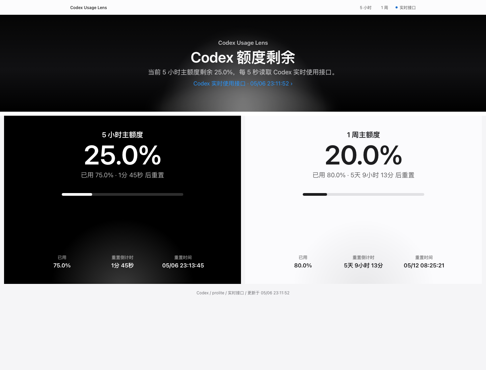

# Codex Usage Lens

[中文](./README.md) | **English**

Codex Usage Lens is a local, privacy-conscious dashboard for Codex Desktop usage limits. It shows the current remaining usage for the 5-hour and 1-week windows.

> This is an unofficial community tool and is not affiliated with OpenAI.



## Features

- Reads the same usage endpoint used by Codex Desktop: `https://chatgpt.com/backend-api/wham/usage`
- Shows remaining percentage, used percentage, reset countdown, and reset time for the 5-hour and 1-week windows
- Refreshes every 5 seconds
- Monitoring only queries the usage API. It does not trigger model inference and does not consume Codex tokens or conversation quota.
- Serves only on `127.0.0.1` by default
- Keeps the access token on the local Node server side and never returns it to the browser
- Falls back to local `~/.codex/sessions` `rate_limits` snapshots when the live endpoint is unavailable

## Requirements

- Node.js 20+
- Codex Desktop signed in on the same machine
- A valid `~/.codex/auth.json` created by Codex Desktop

## Quick Start

```bash
npm install
npm start
```

Open:

```text
http://127.0.0.1:8787
```

## Configuration

| Name | Default | Description |
| --- | --- | --- |
| `HOST` | `127.0.0.1` | HTTP bind host. Keep this local unless you understand the risk. |
| `PORT` | `8787` | Preferred port. The server will try the next ports if it is occupied. |
| `CODEX_HOME` | `~/.codex` | Codex config directory. |
| `CODEX_USAGE_URL` | `https://chatgpt.com/backend-api/wham/usage` | Codex usage endpoint. |
| `HTTPS_PROXY` / `HTTP_PROXY` | unset | Optional proxy used by the server-side usage request. |
| `LIVE_CACHE_MS` | `4000` | Cache duration for successful live usage reads. |
| `FALLBACK_CACHE_MS` | `1500` | Cache duration for local session snapshot fallback. |

## Data Source

Primary source:

```text
GET https://chatgpt.com/backend-api/wham/usage
Authorization: Bearer <tokens.access_token from ~/.codex/auth.json>
```

Fields used:

- `rate_limit.primary_window`: 5-hour window
- `rate_limit.secondary_window`: 1-week window
- `used_percent`: used percentage
- `reset_at`: reset timestamp

Fallback source:

```text
~/.codex/sessions/**/*.jsonl
```

The fallback reads the newest `rate_limits` snapshots emitted into local Codex session logs. These snapshots can be stale, so the UI labels them as local snapshots when the live endpoint cannot be used.

## Privacy

The browser only talks to the local `/api/quota` endpoint. The local Node server reads `~/.codex/auth.json` and calls the usage endpoint server-side. The access token is never returned to the browser API response.

Usage monitoring only calls the usage query API. It does not start Codex conversations or model inference requests, so it does not consume tokens or conversation quota.

`/api/quota` also avoids returning local filesystem paths, auth file paths, or session file paths.

## Scripts

```bash
npm run check
npm start
```

## License

MIT
